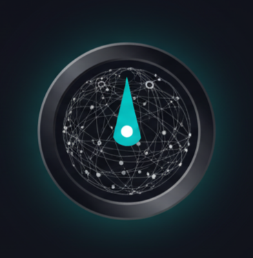

# FORESIGHT - AI Geopolitical Risk Intelligence Platform

<div align="center">



**Real-time geopolitical risk analysis powered by Perplexity AI**

**Live Demo**: [https://signal-xfed.onrender.com](https://signal-xfed.onrender.com)

[Features](#key-features) • [Installation](#installation) • [Usage](#usage) • [API Integration](#perplexity-api-integration)

</div>

---

## Overview

**FORESIGHT** is an AI-powered geopolitical risk intelligence platform that monitors global events in real-time and analyzes their potential impact on critical supply chains and financial markets. Built for the **Perplexity Hackathon (Oct 17-18, 2025)**, it leverages Perplexity's Sonar models to discover, analyze, and visualize geopolitical risks affecting key commodities: **Lithium**, **Crude Oil**, and **Semiconductors**.

The platform automatically discovers breaking news using Perplexity's web search capabilities, performs deep risk analysis with AI, and provides actionable intelligence through an intuitive dashboard.

**Try it now**: Visit [https://signal-xfed.onrender.com](https://signal-xfed.onrender.com) to see FORESIGHT in action.

## What It Does

FORESIGHT transforms raw geopolitical events into actionable intelligence by:

1. **Auto-Discovery**: Continuously scans global news sources using Perplexity Sonar to identify relevant geopolitical events
2. **AI Analysis**: Performs deep risk analysis using Perplexity's advanced language models to assess supply chain impacts
3. **Risk Quantification**: Calculates risk scores (0-10 scale) with component breakdowns across multiple dimensions
4. **Geographic Visualization**: Maps global supply chain vulnerabilities and risk hotspots
5. **Trading Intelligence**: Identifies trading opportunities with real-time market data from Finnhub API
6. **Timeline Tracking**: Maintains historical risk evolution across all monitored assets

## Key Features

### AI-Powered Discovery Stream
- **Automatic News Discovery**: Perplexity Sonar continuously searches the web for breaking geopolitical events
- **Smart Filtering**: AI triages news by relevance, asset impact, and urgency
- **Real-time Updates**: 10-minute polling intervals keep intelligence fresh
- **Collapsible Sidebar**: Space-saving UI that adapts to your workflow

### Intelligent Risk Analysis
- **Multi-Asset Monitoring**: Tracks Lithium, Crude Oil, and Semiconductors simultaneously
- **Component Risk Breakdown**: Analyzes Supply Disruption, Market Sentiment, Company Exposure, and Geopolitical factors
- **Dynamic Risk Scoring**: Visual gauge with 0-10 scale and color-coded severity (Low → Moderate → Elevated → Critical)
- **Historical Timeline**: Track risk evolution over time with event markers

### Interactive Visualizations
- **Global Supply Chain Map**: Geographic visualization of production sites and risk zones using Leaflet/OpenStreetMap
- **Risk Gauge Dashboard**: Real-time circular gauges with animated transitions
- **Trading Opportunities Panel**: AI-identified market opportunities with confidence scores
- **Responsive Design**: Dark theme optimized for professional trading environments

### Financial Intelligence
- **Live Market Data**: Real-time stock quotes via Finnhub API
- **Company Profiles**: Detailed company information and fundamentals
- **Opportunity Scoring**: AI-generated confidence levels for trading strategies
- **Export Capabilities**: JSON/CSV export for further analysis

## Installation

### Quick Access

**Live Deployment**: [https://signal-xfed.onrender.com](https://signal-xfed.onrender.com)

You can access FORESIGHT immediately via the deployed version. For local development or customization, follow the steps below.

### Prerequisites (For Local Setup)

- **Node.js** 20.x or higher
- **npm** or **yarn** package manager
- **Perplexity API Key** ([Get one here](https://www.perplexity.ai/settings/api))
- **Finnhub API Key** ([Free tier available](https://finnhub.io/register))

### Step 1: Clone the Repository

```bash
git clone https://github.com/asad24-dev/Signal.git
cd Signal
```

### Step 2: Install Dependencies

```bash
npm install
```

**Key Dependencies:**
- `next` (15.5.6) - React framework with App Router
- `react` (19.1.0) - UI library
- `@perplexity-ai/perplexity_ai` (0.12.0) - Official Perplexity SDK
- `react-leaflet` (5.0.0) - Interactive maps
- `recharts` (3.3.0) - Data visualization
- `framer-motion` (12.23.24) - Animations
- `lucide-react` (0.546.0) - Icons
- `@radix-ui/*` - Accessible UI components
- `tailwindcss` (4) - Styling

### Step 3: Configure Environment Variables

Create a `.env.local` file in the root directory:

```env
# Required API Keys
PERPLEXITY_API_KEY=pplx-xxxxxxxxxxxxxxxxxxxxxxxxxxxxxxxx
FINNHUB_API_KEY=your_finnhub_api_key_here

# Optional Configuration
NEXT_PUBLIC_MAP_CENTER_LAT=20
NEXT_PUBLIC_MAP_CENTER_LNG=0
NEXT_PUBLIC_MAP_ZOOM=2
```

**Where to get API keys:**
1. **Perplexity API**: Sign up at [perplexity.ai](https://www.perplexity.ai/settings/api)
   - Cost: ~$0.0008 per discovery query (Sonar model), ~$0.035 per deep analysis
2. **Finnhub API**: Register at [finnhub.io](https://finnhub.io/register)
   - Free tier: 60 API calls/minute

### Step 4: Run the Development Server

```bash
npm run dev
```

**Access Points:**
- **Local Development**: [http://localhost:3000](http://localhost:3000)
- **Live Deployment**: [https://signal-xfed.onrender.com](https://signal-xfed.onrender.com)

### Step 5: Build for Production

```bash
npm run build
npm start
```

## Usage

### Live Monitoring Mode (Default)

FORESIGHT operates in **automatic discovery mode** by default:

1. **Automatic Scanning**: The platform automatically starts scanning for geopolitical events when you load the page
2. **Real-time Updates**: Every 10 minutes, Perplexity Sonar searches for breaking news across all monitored assets
3. **Review Headlines**: New headlines appear in the left Discovery Stream with relevance scores
4. **Batch Analysis**: Click "BATCH ANALYZE SIGNALS" to run deep AI analysis on discovered events
5. **Explore Results**: View updated risk scores, trading opportunities, and timeline evolution

### Dashboard Components

#### 1. Asset Selector (Top)
- Select from **Lithium**, **Crude Oil**, or **Semiconductors**
- Dynamic color coding based on current risk level (Green → Yellow → Orange → Red)
- Real-time risk scores displayed on each card

#### 2. Global Supply Chain Map (Left)
- Interactive world map showing production facilities and supply chain nodes
- Color-coded markers indicate risk levels at each location
- Zoom and pan to explore geographic vulnerabilities

#### 3. Risk Gauge (Right)
- Circular gauge displays overall risk score (0-10)
- Component breakdown shows:
  - **Supply Disruption** (35% weight)
  - **Market Sentiment** (25% weight)
  - **Company Exposure** (28% weight)
  - **Geopolitical Factors** (12% weight)
- Animated transitions when risk levels change

#### 4. Trading Opportunities (Middle)
- AI-identified trading strategies based on current analysis
- Confidence scores and rationale for each opportunity
- Direct links to relevant tickers and market data

#### 5. Risk Timeline (Bottom)
- Historical risk evolution for all three assets
- Event markers show when major geopolitical events occurred
- Interactive charts with tooltips

### Collapsible Discovery Stream

Click the **toggle button** on the left edge to collapse/expand the news feed sidebar and maximize screen space for analysis.

## Perplexity API Integration

FORESIGHT leverages **Perplexity AI** as its core intelligence engine through a multi-stage pipeline:

### Integration Architecture

```
News Discovery (Sonar) → AI Triage → Deep Analysis (Sonar Pro) → Risk Scoring
```

### 1. **News Discovery** (`lib/feeds/perplexity-discovery.ts`)

Uses **Perplexity Sonar** model for real-time web search:

```typescript
import perplexityClient from "@/lib/perplexity/client";

const response = await perplexityClient.chat.completions.create({
  model: "sonar",
  messages: [
    {
      role: "system",
      content: "You are a financial news aggregator..."
    },
    {
      role: "user",
      content: "Find recent news about lithium mining, oil production, semiconductors..."
    }
  ]
});
```

**Why Sonar?**
- Real-time web access for breaking news
- Cost-effective at ~$0.0008 per query
- Fast response times for continuous monitoring
- Returns structured JSON with sources and relevance scores

### 2. **AI Triage** (`lib/feeds/ai-triage.ts`)

Filters and prioritizes discovered headlines using **Perplexity Sonar**:

```typescript
const triageResponse = await perplexityClient.chat.completions.create({
  model: "sonar",
  messages: [
    {
      role: "system",
      content: "Analyze which headlines have genuine supply chain impact..."
    }
  ]
});
```

**Benefits:**
- Reduces noise from irrelevant news
- Prioritizes high-impact events
- Assigns urgency and asset-specific relevance

### 3. **Deep Risk Analysis** (`lib/perplexity/batch-chat.ts`)

Performs comprehensive analysis using **Perplexity Sonar Pro**:

```typescript
const analysisResponse = await perplexityClient.chat.completions.create({
  model: "sonar-pro",
  messages: [
    {
      role: "system",
      content: "You are a geopolitical risk analyst..."
    },
    {
      role: "user",
      content: `Analyze this event: ${headline.title}
                Asset: ${asset}
                Provide risk score (0-10), supply chain impact, trading opportunities...`
    }
  ]
});
```

**Why Sonar Pro?**
- Deeper reasoning for complex geopolitical analysis
- More accurate risk quantification
- Better understanding of supply chain dynamics
- Generates actionable trading insights

### 4. **Batch Processing** (`app/api/analyze-batch/route.ts`)

Efficiently analyzes multiple events in parallel:

```typescript
// Process signals in batches of 3 to respect rate limits
for (let i = 0; i < signals.length; i += 3) {
  const batch = signals.slice(i, i + 3);
  const batchPromises = batch.map(signal => analyzeSignal(signal));
  const results = await Promise.all(batchPromises);
  // Aggregate results...
}
```

### API Usage & Cost Optimization

| Operation | Model | Cost/Request | Frequency |
|-----------|-------|--------------|-----------|
| News Discovery | Sonar | $0.0008 | Every 10 min |
| Headline Triage | Sonar | $0.0008 | Per batch |
| Deep Analysis | Sonar Pro | ~$0.035 | On-demand |

**Optimization Strategies:**
- **Caching**: Headlines cached for 10 minutes to reduce redundant queries
- **Batch Processing**: Multiple events analyzed concurrently
- **Smart Filtering**: AI triage eliminates low-value news before expensive deep analysis
- **Rate Limiting**: Built-in delays to respect API limits

### Key Integration Files

```
lib/
├── perplexity/
│   ├── client.ts              # Perplexity SDK initialization
│   ├── chat.ts                # Single analysis wrapper
│   └── batch-chat.ts          # Batch processing logic
├── feeds/
│   ├── perplexity-discovery.ts # News discovery with Sonar
│   ├── ai-triage.ts           # Smart filtering
│   └── aggregator.ts          # Feed orchestration
app/api/
├── analyze/route.ts           # Single event analysis endpoint
└── analyze-batch/route.ts     # Batch analysis endpoint
```

## Tech Stack

**Frontend Framework:**
- Next.js 15.5.6 (App Router, React Server Components)
- React 19.1.0 with TypeScript 5
- Tailwind CSS 4 (JIT compilation)

**AI & Intelligence:**
- Perplexity Sonar (news discovery & triage)
- Perplexity Sonar Pro (deep risk analysis)
- Official `@perplexity-ai/perplexity_ai` SDK (0.12.0)

**Financial Data:**
- Finnhub API (real-time stock quotes, company profiles)
- Custom integration in `lib/finance/finnhub.ts`

**Visualization:**
- Recharts 3.3.0 (timeline charts, analytics)
- React-Leaflet 5.0.0 (interactive maps)
- Framer Motion 12.23.24 (animations)

**UI Components:**
- Radix UI (accessible primitives)
- Lucide React (icon system)
- Custom components in `components/`

## Project Structure

```
Signal/
├── app/                          # Next.js App Router
│   ├── api/
│   │   ├── analyze/             # Single event analysis endpoint
│   │   ├── analyze-batch/       # Batch processing endpoint
│   │   ├── assets/              # Asset data API
│   │   └── feeds/
│   │       ├── scan/            # Perplexity news discovery
│   │       └── stream/          # Real-time headline stream
│   ├── globals.css              # Global styles (dark theme)
│   ├── layout.tsx               # Root layout
│   └── page.tsx                 # Main dashboard
│
├── components/                   # React Components
│   ├── AnalysisModal.tsx        # Event analysis modal
│   ├── AssetSelector.tsx        # Asset selection cards
│   ├── DiscoveryStream.tsx      # News feed sidebar
│   ├── GlobalRiskMap.tsx        # Interactive world map
│   ├── RiskGauge.tsx            # Circular risk gauge
│   ├── TimelineChart.tsx        # Historical risk charts
│   ├── TradingOpportunities.tsx # Trading intelligence panel
│   └── ui/                      # Radix UI primitives
│
├── lib/                          # Core Logic
│   ├── perplexity/
│   │   ├── client.ts            # Perplexity SDK initialization
│   │   ├── chat.ts              # Single completion wrapper
│   │   └── batch-chat.ts        # Batch processing
│   ├── feeds/
│   │   ├── perplexity-discovery.ts  # Sonar news discovery
│   │   ├── ai-triage.ts         # Smart headline filtering
│   │   ├── aggregator.ts        # Feed orchestration
│   │   └── types.ts             # Feed type definitions
│   ├── finance/
│   │   └── finnhub.ts           # Market data integration
│   ├── risk/
│   │   ├── scorer.ts            # Risk calculation engine
│   │   └── llm-scorer.ts        # AI-powered risk scoring
│   └── data/
│       ├── assets.ts            # Asset definitions
│       └── scenarios.ts         # Demo scenarios
│
├── types/
│   ├── index.ts                 # Core type definitions
│   └── finance.ts               # Financial types
│
├── public/                       # Static assets
├── .env.local                    # Environment variables (create this)
├── package.json                  # Dependencies
├── tsconfig.json                 # TypeScript config
├── tailwind.config.ts            # Tailwind configuration
└── README.md                     # This file
```

## Development

### Available Scripts

```bash
# Development
npm run dev          # Start dev server with Turbopack (http://localhost:3000)

# Production
npm run build        # Build optimized production bundle
npm start            # Start production server

# Code Quality
npm run lint         # Run ESLint
npm run type-check   # Check TypeScript types (if configured)
```

### Development Tips

1. **Hot Reload**: Turbopack provides instant hot module replacement
2. **Type Safety**: TypeScript strict mode is enabled
3. **API Routes**: All endpoints are in `app/api/` following Next.js conventions
4. **Component Structure**: Client components marked with `'use client'`
5. **Styling**: Tailwind utility classes with custom dark theme

## Troubleshooting

### API Key Issues

**Problem**: "Missing Perplexity API key" error
- **Solution**: Ensure `PERPLEXITY_API_KEY` is set in `.env.local`
- **Verify**: Check `process.env.PERPLEXITY_API_KEY` is not undefined

**Problem**: "Finnhub API rate limit exceeded"
- **Solution**: Free tier allows 60 calls/min. Reduce analysis frequency or upgrade plan
- **Workaround**: Implement client-side caching for stock data

### Rate Limits & Costs

| Service | Limit | Cost | Notes |
|---------|-------|------|-------|
| Perplexity Sonar | No hard limit | $0.0008/query | News discovery |
| Perplexity Sonar Pro | No hard limit | ~$0.035/query | Deep analysis |
| Finnhub Free Tier | 60 calls/min | Free | Stock quotes |
| Finnhub Premium | 300-600 calls/min | $7.49-24.99/mo | More data |

**Cost Estimates:**
- Hourly discovery (6 scans): ~$0.0048/hour
- 10 deep analyses: ~$0.35/session
- Daily operation (~100 analyses): ~$3.50/day

### Common Issues

**Problem**: No headlines appearing in Discovery Stream
- Check Perplexity API key is valid
- Open browser DevTools → Console for error messages
- Verify `/api/feeds/scan` returns 200 status

**Problem**: "Cannot read property 'currentRiskScore' of undefined"
- Asset data may not be loaded yet
- Check `/api/assets` endpoint is working
- Ensure localStorage isn't blocking asset data

**Problem**: Map not rendering
- Verify Leaflet CSS is imported in `globals.css`
- Check browser console for tile loading errors
- Ensure `react-leaflet` is compatible with React 19

**Problem**: TypeScript errors after npm install
- Run `npm install @types/react@19 @types/react-dom@19`
- Clear `.next` folder: `rm -rf .next && npm run dev`

### Debug Mode

Enable verbose logging by adding to `.env.local`:

```env
NODE_ENV=development
NEXT_PUBLIC_DEBUG=true
```

This will log:
- Perplexity API request/response details
- Risk calculation breakdowns
- Feed aggregation steps

## UI/UX Features

- **Dark Professional Theme**: Optimized for trading desk environments with black backgrounds and red accents
- **Responsive Layout**: Adapts seamlessly from desktop to tablet
- **Collapsible Sidebar**: Toggle discovery stream to maximize chart viewing space
- **Real-time Animations**: Smooth transitions using Framer Motion
- **Accessibility**: Built with Radix UI primitives for keyboard navigation and screen readers
- **Visual Hierarchy**: Clear information architecture from asset selection → visualization → opportunities

## Security & Privacy

- **API Key Protection**: All keys stored in `.env.local` (never committed to git)
- **Server-Side API Calls**: Sensitive operations happen in Next.js API routes
- **No User Data Storage**: Platform is stateless; no personal information collected
- **HTTPS Required**: Production deployment should use SSL/TLS

## Deployment

### Vercel (Recommended)

1. Push code to GitHub
2. Import project in Vercel dashboard
3. Add environment variables:
   - `PERPLEXITY_API_KEY`
   - `FINNHUB_API_KEY`
4. Deploy!

```bash
npm i -g vercel
vercel
```

### Docker

```dockerfile
FROM node:20-alpine
WORKDIR /app
COPY package*.json ./
RUN npm install
COPY . .
RUN npm run build
EXPOSE 3000
CMD ["npm", "start"]
```

```bash
docker build -t foresight .
docker run -p 3000:3000 --env-file .env.local foresight
```

## Contributing

Contributions are welcome! Please follow these guidelines:

1. Fork the repository
2. Create a feature branch: `git checkout -b feature/amazing-feature`
3. Commit changes: `git commit -m 'Add amazing feature'`
4. Push to branch: `git push origin feature/amazing-feature`
5. Open a Pull Request

### Development Guidelines

- Follow TypeScript strict mode conventions
- Use Tailwind utility classes (avoid custom CSS)
- Add JSDoc comments for complex functions
- Test API endpoints with sample data
- Ensure responsive design on mobile

## License

MIT License - see [LICENSE](LICENSE) file for details

## Acknowledgments

- **Perplexity AI** for providing the intelligence layer and web search capabilities
- **Finnhub** for real-time financial market data
- **Radix UI** for accessible component primitives
- **Vercel** for Next.js framework and hosting platform
- **OpenStreetMap** contributors for map tiles

## Contact

**Live Demo**: [https://signal-xfed.onrender.com](https://signal-xfed.onrender.com)

**Project Repository**: [github.com/asad24-dev/Signal](https://github.com/asad24-dev/Signal)

**Built for**: Perplexity Hackathon (October 17-18, 2025)

---

<div align="center">

**FORESIGHT** - Anticipate. Analyze. Act.

*Transforming geopolitical chaos into strategic clarity*

</div>
